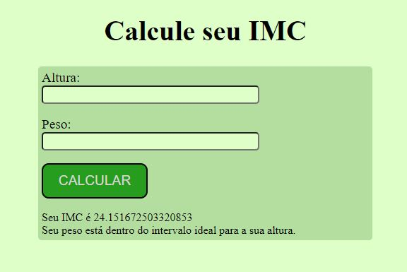

# Calculadora de IMC

## Objetivo
Calcular o IMC do usuário de acordo com a altura e o peso fornecidos, e verificar em que intervalo está o resultado.

## Tecnologias utilizadas
<ul>
<li>HTML</li>
<li>CSS</li>
<li>JavaScript</li>
</ul>

## Fonte das informações sobre o IMC
[Minha Vida Saúde](https://www.minhavida.com.br/saude/tratamento/3870-imc#:~:text=O%20IMC%20é%20calculado%20dividindo,pelo%20resultado%20da%20última%20conta.&text=Por%20exemplo%2C%20uma%20pessoa%20com,1%2C70%20%3D%202%2C89)